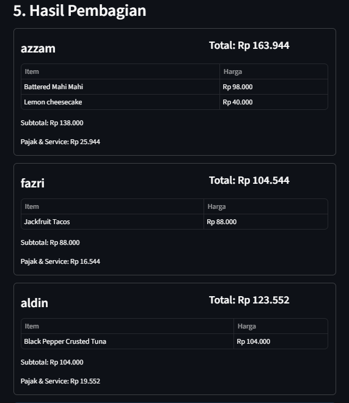
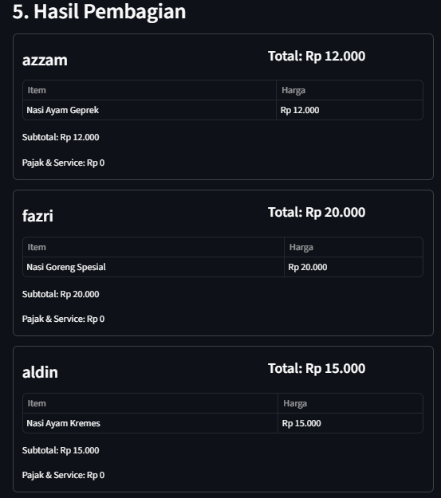

# SmartSplit Bill

## Fitur

- Baca struk otomatis pakai AI (Gemini), tanpa OCR manual.
- Edit hasil bacaan kalau ada yang salah baca.
- Tambah peserta dan assign tiap item ke orang yang bayar.
- Satu item bisa dibayar bersama (harganya dibagi rata).
- Pajak/service dibagi.
- Download ringkasan pembagian dalam bentuk file teks.

## Cara Install & Menjalankan

1. Bikin virtual environment dan aktifin:
   ```bash
   python -m venv venv
   # Windows
   venv\Scripts\activate
   # Mac/Linux
   source venv/bin/activate
   ```

2. Install dependency:
   ```bash
   pip install -r requirements.txt
   ```

3. Jalanin aplikasinya:
   ```bash
   streamlit run app.py
   ```

4. Masukan Google API Key di sidebar

## Cara Pakai

1. Upload foto struk.
2. Klik "Baca struk pakai AI".
3. Cek hasil bacaannya, edit kalau ada yang salah atau kurang.
4. Tambahkan nama orang-orang yang ikut.
5. Tiap item, pilih siapa yang bayar. Klik "Hitung pembagian".

## Contoh Hasil Bacaan

### Struk 1 bill_.jpg

Subtotal Rp 330.000, total (sudah termasuk pajak & service) Rp 392.040.



### Struk 2 bill2.jpg

Total Rp 47.000.



## Step 1_Riset Model

Dua model OCR free dibandingin: **Donut** (model lokal) dan **Gemini** (API). Pengujian pakai dua foto struk dengan format berbeda. Detailnya ada di `riset_model.ipynb`.

| Aspek | Donut | Gemini |
|-------|-------|--------|
| Jenis | model lokal (HuggingFace) | API (Google) |
| Struk 1 | banyak salah — baris header & alamat kebaca jadi item menu, total kebaca Rp 230.000 (aslinya Rp 392.040) | akurat, total Rp 392.040 |
| Struk 2 | 3 item utama kebaca benar, tapi masih tercampur baris header | akurat, total Rp 47.000 |
| Kecepatan (per struk) | ~23–30 detik | ~5 detik |

Pengujian dijalankan di Google Colab.

**Model yang dipilih: Gemini.** Alasannya hasil bacaannya akurat di dua struk dengan format berbeda sekaligus jauh lebih cepat. Versi donut terikat pada format struk tertentu, jadi gampang salah baca begitu format struknya beda dari data latihannya.

## Step 3_Evaluasi & Analisis

### a. Model pembaca struk (Gemini)

**Kelemahan**
- Butuh koneksi internet dan API key, jadi gak bisa jalan offline.
- Pemakaian API ada batas token.
- Akurasi bisa turun, seperti jika foto struk miring, blurr, atau pencahayaan yang kurang. 

**Ide perbaikan**
- Sediakan model cadangan yang bisa jalan offline untuk keadaan tanpa internet.
- Cek kualitas foto: sebelum dikirim ke AI, cek dulu fotonya cukup jelas atau tidak. Kalau tidak, minta user untuk foto ulang.
- AI tandai yang dia ragu: minta Gemini kasih tanda di item yang dia gak yakin bacanya. User tinggal fokus ngecek yang ditandai.

### b. Produk (aplikasi web)

**Kelemahan**
- Pembagian satu item cuma bisa dibagi rata ke orang yang dipilih, belum bisa atur jumlah berbeda per orang dalam satu item (misal satu orang ambil 2 porsi, satu orang lagi ambil 1 porsi).
- Pajak dan service masih digabung jadi satu, belum dipisah.
- Kalau ada item yang lupa diassign ke siapa pun, item itu gak ikut terhitung, jadi total semua orang bisa lebih kecil dari total tagihan.
- Belum ada fitur simpan atau bagikan hasil pembagian.

**Ide perbaikan**
- Ganti pemilihan peserta jadi input jumlah per orang, supaya bisa atur porsi berbeda dalam satu item.
- Pisahin pajak dan service dengan membaca keduanya langsung dari struk.
- Tambah validasi supaya semua item harus sudah diassign sebelum dihitung.
- Tambah fitur simpan riwayat atau bagikan hasil lewat link/file.

